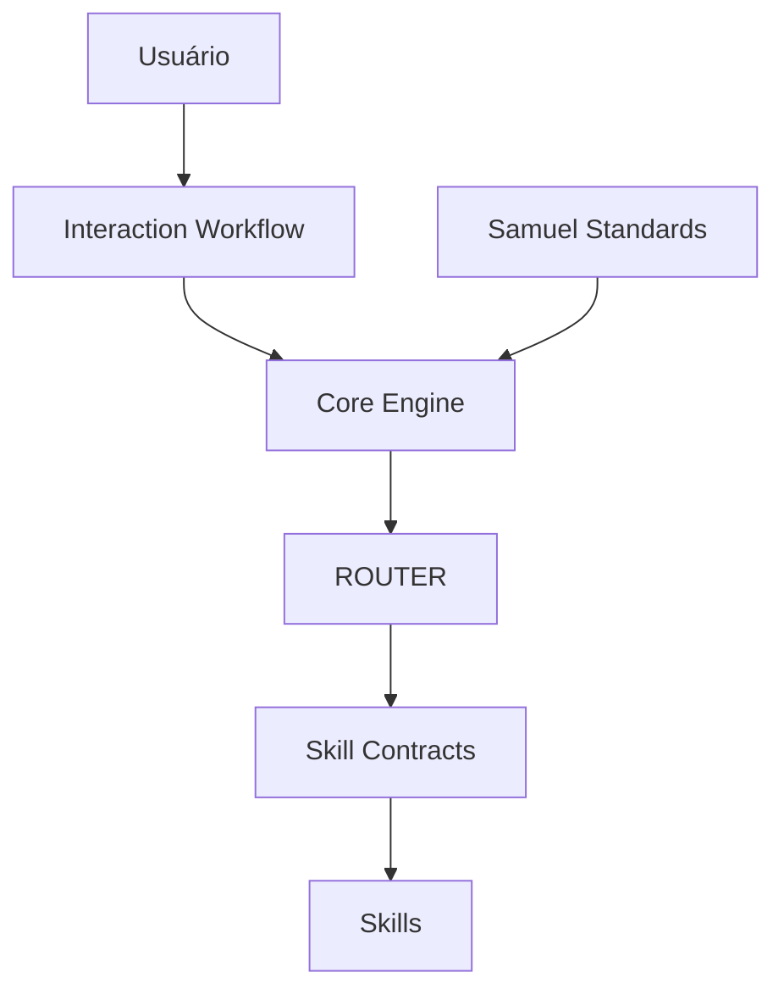

# Samuel Skills System (SSS)

> Framework modular para compreender, planejar, validar, executar e documentar projetos complexos utilizando Skills especializadas.

**Versão Estável:** `v1.0.0`

**Próxima Versão:** `v1.1.0 (em desenvolvimento)`

---

## Índice

- [Visão Geral](#visão-geral)
- [Objetivos](#objetivos)
- [Filosofia](#filosofia)
- [Por que utilizar o Samuel Skills System?](#por-que-utilizar-o-samuel-skills-system)
- [Arquitetura](#arquitetura-atual)
- [Core](#core)
- [Fluxo Operacional](#fluxo-operacional)
- [Estrutura do Projeto](#estrutura-do-projeto)
- [Roadmap](#roadmap)
- [Status](#status)
- [Contribuição](#contribuição)
- [Licença](#licença)


## Visão Geral

O **Samuel Skills System (SSS)** é uma arquitetura modular desenvolvida para organizar o trabalho do ChatGPT em responsabilidades especializadas (Skills).

Ao invés de utilizar um único prompt gigantesco, o sistema divide responsabilidades entre componentes especializados, permitindo maior organização, rastreabilidade, reutilização e evolução contínua.

Cada Skill possui uma responsabilidade única e pode atuar individualmente ou em conjunto, formando um pipeline completo para condução de projetos.

---

## Objetivos

O Samuel Skills System foi desenvolvido para:

- Organizar projetos complexos em responsabilidades especializadas.
- Preservar contexto durante todo o ciclo de vida do projeto.
- Reduzir retrabalho através de um fluxo estruturado.
- Garantir rastreabilidade entre decisões, evidências e documentação.
- Facilitar a evolução contínua do sistema através de uma arquitetura modular.

---

# Filosofia

O Samuel Skills System é baseado em alguns princípios fundamentais:

- Compreender antes de executar.
- Planejar antes de modificar.
- Validar antes de prosseguir.
- Executar de forma controlada.
- Preservar contexto.
- Favorecer modularização.
- Evitar retrabalho.
- Garantir rastreabilidade.

---

# Por que utilizar o Samuel Skills System?

Modelos de IA costumam concentrar toda a lógica em um único prompt.

O Samuel Skills System propõe uma abordagem diferente: dividir responsabilidades entre Skills especializadas, cada uma responsável por uma etapa específica do fluxo operacional.

Essa arquitetura proporciona:

- maior organização;
- maior reutilização;
- melhor manutenção;
- rastreabilidade das decisões;
- evolução incremental do sistema.

---

## Arquitetura Atual



# Core

O Core Engine foi introduzido na versão v1.1 para centralizar a orquestração operacional do Samuel Skills System.

Ele atua entre os padrões globais (Samuel Standards), o ROUTER e as Skills, sendo responsável por coordenar o fluxo operacional sem executar atividades especializadas.

Atualmente é composto por:

| Componente | Responsabilidade |
|--------|------------------|
| Core Engine | Orquestração operacional, estado global e controle de fluxo |
| Interaction Workflow | Controle da experiência de interação e comunicação |
| Modo Foco | Condução estruturada de projetos |
| Project Analyzer | Reconstrução de contexto |
| Dependency Validator | Validação de dependências |
| Evidence Manager | Gestão de evidências |
| Technical Report | Geração de documentação |
| Skill Creator | Criação de novas Skills |

---

# Fluxo Operacional

## Projeto desconhecido

```
Projeto

↓

Project Analyzer

↓

Modo Foco

↓

Dependency Validator

↓

Implementação

↓

Evidence Manager

↓

Technical Report
```

---

## Projeto novo

```
Ideia

↓

Modo Foco

↓

Dependency Validator

↓

Implementação

↓

Evidence Manager

↓

Technical Report
```

---

## Nova Skill

```
Necessidade

↓

Skill Creator

↓

Samuel Standards

↓

Integração ao Core

↓

Validação

↓

Nova Skill
```

---

# Estrutura do Projeto

```
Samuel Skills System
│
├── core/
│   ├── core-engine/
│   │   ├── README.md
│   │   ├── state-manager.md
│   │   ├── pipeline-builder.md
│   │   ├── operational-status.md
│   │   ├── transition-manager.md
│   │   ├── continuity-manager.md
│   │   ├── consistency-validator.md
│   │   └── history-manager.md
│   │
│   ├── interaction-workflow/
│   │   ├── README.md
│   │   ├── phase-controller.md
│   │   ├── execution-flow-controller.md
│   │   ├── response-optimizer.md
│   │   ├── communication-adapter.md
│   │   └── context-boundary-controller.md
│   │
│   ├── samuel-standards.md
│   ├── modo-foco.md
│   ├── project-analyzer.md
│   ├── dependency-validator.md
│   ├── evidence-manager.md
│   ├── technical-report.md
│   └── skill-creator.md
│
├── extensions/
│
├── .gitignore
├── CHANGELOG.md
├── README.md
├── ROUTER.md
├── SYSTEM_INSTRUCTIONS.md
└── SYSTEM_PROMPT.md
```

---

# Roadmap

## v1.0 ✅ Stable

- Samuel Standards
- ROUTER
- Core
- GPT Integration
- Homologação Completa

---

## v1.1 🚧 Em desenvolvimento

### FEATURE-001 — Core Engine

**Status**

- ✅ Arquitetura
- ✅ Documentação
- ✅ Implementação
- ✅ Homologação

---

### FEATURE-002 — Interaction Workflow

**Status**

- ✅ Arquitetura
- ✅ Componentes
- ✅ Documentação
- ⏳ Homologação

## Futuro

- Presentation Builder
- Defense Assistant
- Research Analyzer
- Environment Builder
- Architecture Designer
- Workflow Engine

---

# Status

| Item | Status |
|-------|--------|
| Arquitetura | ✅ |
| Core | ✅ |
| Core Engine | ✅ |
| Interaction Workflow | 🚧 |
| GPT | ✅ |
| Testes | 🚧 |
| Stable | ✅ |

---

# Contribuição

Toda evolução do sistema deve seguir:

Samuel Standards

↓

Issue

↓

Discussion

↓

Milestone

↓

Implementação

↓

Testes

↓

Pull Request

↓

Release

---

# Licença

Ainda não definida.

O projeto encontra-se em desenvolvimento ativo.

---

# Autor

**Samuel Skills System**

Framework desenvolvido por **Samuel** para construção de assistentes especializados baseados em arquitetura modular e rastreabilidade operacional.