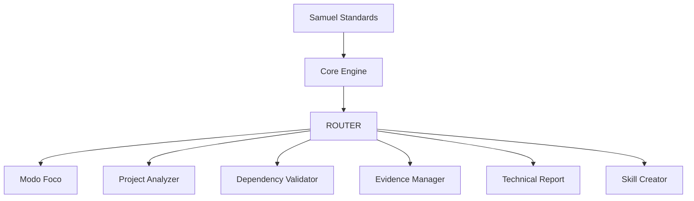

# Samuel Skills System (SSS)

> Framework modular para compreender, planejar, validar, executar e documentar projetos complexos utilizando Skills especializadas.

**Versão Atual:** `v1.0.0 Stable`

---


## Índice

- [Visão Geral](#visão-geral)
- [Objetivos](#objetivos)
- [Filosofia](#filosofia)
- [Por que utilizar o Samuel Skills System?](#por-que-utilizar-o-samuel-skills-system)
- [Arquitetura](#arquitetura-atual)
- [Core](#core)
- [Fluxo Operacional](#fluxo-operacional)
- [Estrutura do Projeto](#estrutura-do-projeto)
- [Roadmap](#roadmap)
- [Status](#status)
- [Contribuição](#contribuição)
- [Licença](#licença)


## Visão Geral

O **Samuel Skills System (SSS)** é uma arquitetura modular desenvolvida para organizar o trabalho do ChatGPT em responsabilidades especializadas (Skills).

Ao invés de utilizar um único prompt gigantesco, o sistema divide responsabilidades entre componentes especializados, permitindo maior organização, rastreabilidade, reutilização e evolução contínua.

Cada Skill possui uma responsabilidade única e pode atuar individualmente ou em conjunto, formando um pipeline completo para condução de projetos.

---

## Objetivos

O Samuel Skills System foi desenvolvido para:

- Organizar projetos complexos em responsabilidades especializadas.
- Preservar contexto durante todo o ciclo de vida do projeto.
- Reduzir retrabalho através de um fluxo estruturado.
- Garantir rastreabilidade entre decisões, evidências e documentação.
- Facilitar a evolução contínua do sistema através de uma arquitetura modular.

---

# Filosofia

O Samuel Skills System é baseado em alguns princípios fundamentais:

- Compreender antes de executar.
- Planejar antes de modificar.
- Validar antes de prosseguir.
- Executar de forma controlada.
- Preservar contexto.
- Favorecer modularização.
- Evitar retrabalho.
- Garantir rastreabilidade.

---

# Por que utilizar o Samuel Skills System?

Modelos de IA costumam concentrar toda a lógica em um único prompt.

O Samuel Skills System propõe uma abordagem diferente: dividir responsabilidades entre Skills especializadas, cada uma responsável por uma etapa específica do fluxo operacional.

Essa arquitetura proporciona:

- maior organização;
- maior reutilização;
- melhor manutenção;
- rastreabilidade das decisões;
- evolução incremental do sistema.

---

## Arquitetura Atual

(diagrama atual)

---

## Arquitetura Planejada (v1.1)


O **Samuel Standards** define os padrões globais.

O **ROUTER** determina qual Skill deve ser utilizada.

As demais Skills executam responsabilidades específicas.

---

# Core

O Core representa o núcleo operacional do sistema.

Atualmente é composto por:

| Skill | Responsabilidade |
|--------|------------------|
| [`Modo Foco`](core/modo-foco.md) | Condução estruturada de projetos |
| [`Project Analyzer`](core/project-analyzer.md) | Reconstrução de contexto |
| [`Dependency Validator`](core/dependency-validator.md) | Validação de dependências |
| [`Evidence Manager`](core/evidence-manager.md) | Gestão de evidências |
| [`Technical Report`](core/technical-report.md) | Geração de documentação |
| [`Skill Creator`](core/skill-creator.md) | Criação de novas Skills |

---

# Fluxo Operacional

## Projeto desconhecido

```
Projeto

↓

Project Analyzer

↓

Modo Foco

↓

Dependency Validator

↓

Implementação

↓

Evidence Manager

↓

Technical Report
```

---

## Projeto novo

```
Ideia

↓

Modo Foco

↓

Dependency Validator

↓

Implementação

↓

Evidence Manager

↓

Technical Report
```

---

## Nova Skill

```
Necessidade

↓

Skill Creator

↓

Samuel Standards

↓

Integração ao Core

↓

Validação

↓

Nova Skill
```

---

# Estrutura do Projeto

```
Samuel Skills System
│
├── core/
│   ├── samuel-standards.md
│   ├── modo-foco.md
│   ├── project-analyzer.md
│   ├── dependency-validator.md
│   ├── evidence-manager.md
│   ├── technical-report.md
│   └── skill-creator.md
│
├── extensions/
│
├── README.md
├── ROUTER.md
├── CHANGELOG.md
├── SYSTEM_INSTRUCTIONS.md
└── SYSTEM_PROMPT.md
```

---

# Roadmap

## v1.0 ✅ Stable

- Samuel Standards
- ROUTER
- Core
- GPT Integration
- Homologação Completa

---

## v1.1 🚧

- Core Engine
- Estado Global
- Transições entre Skills
- Histórico de Execução
- Melhorias de Rastreabilidade

---

## Futuro

- Presentation Builder
- Defense Assistant
- Research Analyzer
- Environment Builder
- Architecture Designer
- Workflow Engine

---

# Status

| Item | Status |
|-------|--------|
| Arquitetura | ✅ |
| Core | ✅ |
| GPT | ✅ |
| Testes | ✅ |
| Stable | ✅ |

---

# Contribuição

Toda evolução do sistema deve seguir:

Samuel Standards

↓

Issue

↓

Discussion

↓

Milestone

↓

Implementação

↓

Testes

↓

Pull Request

↓

Release

---

# Licença

Ainda não definida.

O projeto encontra-se em desenvolvimento ativo.

---

# Autor

**Samuel Skills System**

Framework desenvolvido por **Samuel** para construção de assistentes especializados baseados em arquitetura modular e rastreabilidade operacional.